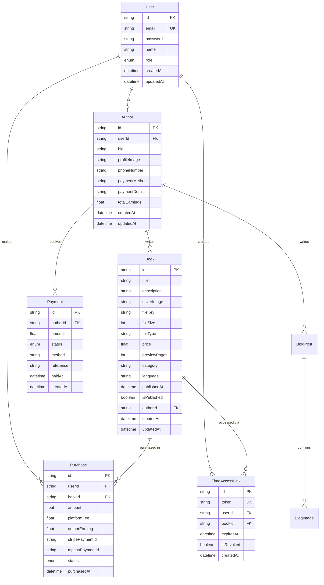

# Database Schema Documentation

## Overview

AfriReads uses Cloudflare D1 (SQLite) as the database, managed via Prisma ORM. The schema is defined in `prisma/schema.prisma`.

## Entity Relationship Diagram



## Models

### User

Represents all users in the system (readers, authors, admins).

**Fields:**
- `id` (UUID) - Primary key
- `email` (String, Unique) - User's email address
- `password` (String) - Hashed password (bcrypt)
- `name` (String, Optional) - User's full name
- `role` (Enum) - User role: `READER`, `AUTHOR`, or `ADMIN`
- `createdAt` (DateTime) - Account creation timestamp
- `updatedAt` (DateTime) - Last update timestamp

**Relations:**
- One-to-one with `Author` (if user is an author)
- One-to-many with `Purchase`
- One-to-many with `TimeAccessLink`

**Indexes:**
- Unique index on `email`

---

### Author

Extended profile for users with author role.

**Fields:**
- `id` (UUID) - Primary key
- `userId` (UUID, Unique) - Foreign key to User
- `bio` (String, Optional) - Author biography
- `profileImage` (String, Optional) - R2 key for profile image
- `phoneNumber` (String, Optional) - Contact number
- `paymentMethod` (String, Optional) - Payment preference (e.g., "mpesa", "bank")
- `paymentDetails` (String, Optional) - JSON string with payment info
- `totalEarnings` (Float) - Cumulative earnings from book sales
- `createdAt` (DateTime) - Profile creation timestamp
- `updatedAt` (DateTime) - Last update timestamp

**Relations:**
- One-to-one with `User`
- One-to-many with `Book`
- One-to-many with `Payment`

**Indexes:**
- Unique index on `userId`

**Payment Details JSON Structure:**
```json
{
  "mpesa": {
    "phoneNumber": "+254712345678",
    "name": "John Doe"
  },
  "bank": {
    "accountNumber": "1234567890",
    "bankName": "Example Bank",
    "accountName": "John Doe"
  }
}
```

---

### Book

Represents books available on the platform.

**Fields:**
- `id` (UUID) - Primary key
- `title` (String) - Book title
- `description` (String, Optional) - Book description/synopsis
- `coverImage` (String, Optional) - R2 key for cover image
- `fileKey` (String) - R2 object key for book file
- `fileSize` (Integer) - File size in bytes
- `fileType` (String) - File type (pdf, epub)
- `price` (Float) - Book price in KES
- `previewPages` (Integer) - Number of preview pages (default: 10)
- `category` (String, Optional) - Book category/genre
- `language` (String) - Book language (default: "Kalenjin")
- `publishedAt` (DateTime, Optional) - Publication date
- `isPublished` (Boolean) - Publication status (default: false)
- `authorId` (UUID) - Foreign key to Author
- `createdAt` (DateTime) - Creation timestamp
- `updatedAt` (DateTime) - Last update timestamp

**Relations:**
- Many-to-one with `Author`
- One-to-many with `Purchase`
- One-to-many with `TimeAccessLink`

**Indexes:**
- Index on `authorId`
- Index on `isPublished`
- Index on `category`

---

### Purchase

Tracks book purchases and transactions.

**Fields:**
- `id` (UUID) - Primary key
- `userId` (UUID) - Foreign key to User
- `bookId` (UUID) - Foreign key to Book
- `amount` (Float) - Total purchase amount
- `platformFee` (Float) - Platform commission
- `authorEarning` (Float) - Amount credited to author
- `stripePaymentId` (String, Optional) - Stripe payment intent ID
- `mpesaPaymentId` (String, Optional) - M-Pesa transaction ID
- `status` (Enum) - Purchase status: `PENDING`, `COMPLETED`, `FAILED`, `REFUNDED`
- `purchasedAt` (DateTime) - Purchase timestamp

**Relations:**
- Many-to-one with `User`
- Many-to-one with `Book`

**Indexes:**
- Index on `userId`
- Index on `bookId`
- Index on `status`

**Business Logic:**
```typescript
const platformCommission = 10; // 10%
const platformFee = amount * (platformCommission / 100);
const authorEarning = amount - platformFee;
```

---

### Payment

Tracks payouts to authors.

**Fields:**
- `id` (UUID) - Primary key
- `authorId` (UUID) - Foreign key to Author
- `amount` (Float) - Payout amount
- `status` (Enum) - Payment status: `PENDING`, `PROCESSING`, `COMPLETED`, `FAILED`
- `method` (String) - Payment method (mpesa, bank_transfer)
- `reference` (String, Optional) - Transaction reference
- `paidAt` (DateTime, Optional) - Payment completion timestamp
- `createdAt` (DateTime) - Request creation timestamp

**Relations:**
- Many-to-one with `Author`

**Indexes:**
- Index on `authorId`
- Index on `status`

---

### TimeAccessLink

Manages temporary book access via special links.

**Fields:**
- `id` (UUID) - Primary key
- `token` (String, Unique) - Access token (hex string)
- `userId` (UUID) - Foreign key to User
- `bookId` (UUID) - Foreign key to Book
- `expiresAt` (DateTime) - Link expiration timestamp
- `isRevoked` (Boolean) - Revocation status (default: false)
- `createdAt` (DateTime) - Creation timestamp

**Relations:**
- Many-to-one with `User`
- Many-to-one with `Book`

**Indexes:**
- Unique index on `token`
- Index on `userId`
- Index on `bookId`
- Index on `expiresAt`

**Token Generation:**
```typescript
import { randomBytes } from 'crypto';
const token = randomBytes(32).toString('hex'); // 64 characters
```

---

## Migrations

### Creating Migrations

```bash
# Create a new migration
npx prisma migrate dev --name migration_name

# Apply migrations to D1 (production)
npx wrangler d1 execute kalenjin-books-db --file=./prisma/migrations/YYYYMMDDHHMMSS_migration_name/migration.sql
```

### Migration History

Migrations are stored in `prisma/migrations/` directory.

---

## Queries

### Common Query Patterns

#### Get Books with Author Info

```typescript
const books = await prisma.book.findMany({
  where: { isPublished: true },
  include: {
    author: {
      include: {
        user: {
          select: { name: true }
        }
      }
    }
  }
});
```

#### Get User's Purchased Books

```typescript
const purchases = await prisma.purchase.findMany({
  where: { 
    userId: userId,
    status: 'COMPLETED'
  },
  include: {
    book: {
      include: {
        author: {
          include: {
            user: { select: { name: true } }
          }
        }
      }
    }
  }
});
```

#### Get Author Earnings

```typescript
const earnings = await prisma.purchase.aggregate({
  where: {
    book: { authorId: authorId },
    status: 'COMPLETED'
  },
  _sum: {
    authorEarning: true
  }
});
```

---

## BlogPost

Stores blog posts created by authors.

### Fields

- `id` (String, PK): Unique identifier
- `title` (String, required): Blog post title
- `slug` (String, unique, required): URL-friendly slug for SEO
- `content` (String, required): HTML content of the blog post
- `excerpt` (String, optional): Short summary/preview text
- `coverImage` (String, optional): URL to cover image
- `authorId` (String, FK, required): Reference to Author
- `isPublished` (Boolean, default: false): Publication status
- `publishedAt` (DateTime, optional): Publication timestamp
- `viewCount` (Int, default: 0): Number of views
- `createdAt` (DateTime): Creation timestamp
- `updatedAt` (DateTime): Last update timestamp

### Relations

- `author`: Many-to-one with Author
- `images`: One-to-many with BlogImage

### Indexes

- Unique index on `slug`
- Index on `authorId` for efficient author queries
- Index on `isPublished` for filtering published posts

### Example

```prisma
model BlogPost {
  id          String      @id @default(uuid())
  title       String
  slug        String      @unique
  content     String
  excerpt     String?
  coverImage  String?
  authorId    String
  isPublished Boolean     @default(false)
  publishedAt DateTime?
  viewCount   Int         @default(0)
  createdAt   DateTime    @default(now())
  updatedAt   DateTime    @updatedAt
  
  author      Author      @relation(fields: [authorId], references: [id], onDelete: Cascade)
  images      BlogImage[]
  
  @@index([authorId])
  @@index([isPublished])
}
```

---

## BlogImage

Tracks images uploaded for blog posts, stored in Cloudflare R2.

### Fields

- `id` (String, PK): Unique identifier
- `blogPostId` (String, FK, optional): Reference to BlogPost
- `imageKey` (String, required): R2 object key
- `altText` (String, optional): Alternative text for accessibility
- `createdAt` (DateTime): Upload timestamp

### Relations

- `blogPost`: Many-to-one with BlogPost (optional)

### Example

```prisma
model BlogImage {
  id         String    @id @default(uuid())
  blogPostId String?
  imageKey   String
  altText    String?
  createdAt  DateTime  @default(now())
  
  blogPost   BlogPost? @relation(fields: [blogPostId], references: [id], onDelete: SetNull)
  
  @@index([blogPostId])
}
```

---

## Database Maintenance

### Backup

```bash
# Export D1 database
npx wrangler d1 export kalenjin-books-db --output=backup.sql
```

### Restore

```bash
# Import to D1 database
npx wrangler d1 execute kalenjin-books-db --file=backup.sql
```

### Cleanup Expired Links

Run periodically (e.g., daily cron job):

```typescript
import { cleanupExpiredLinks } from '@/lib/access-links';

const deletedCount = await cleanupExpiredLinks();
console.log(`Deleted ${deletedCount} expired access links`);
```

---

## Performance Considerations

### Indexes

All foreign keys and frequently queried fields have indexes for optimal performance.

### Query Optimization

- Use `select` to fetch only needed fields
- Use `include` judiciously to avoid N+1 queries
- Implement pagination for large result sets
- Cache frequently accessed data in Cloudflare KV

### D1 Limitations

- Maximum database size: 10GB (can be increased)
- Maximum query execution time: 30 seconds
- No full-text search (implement using external service if needed)
